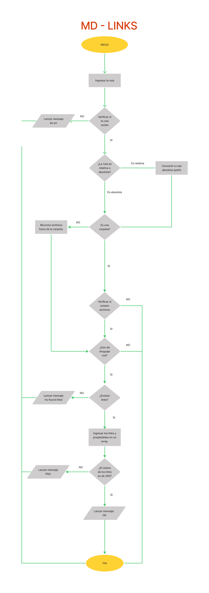
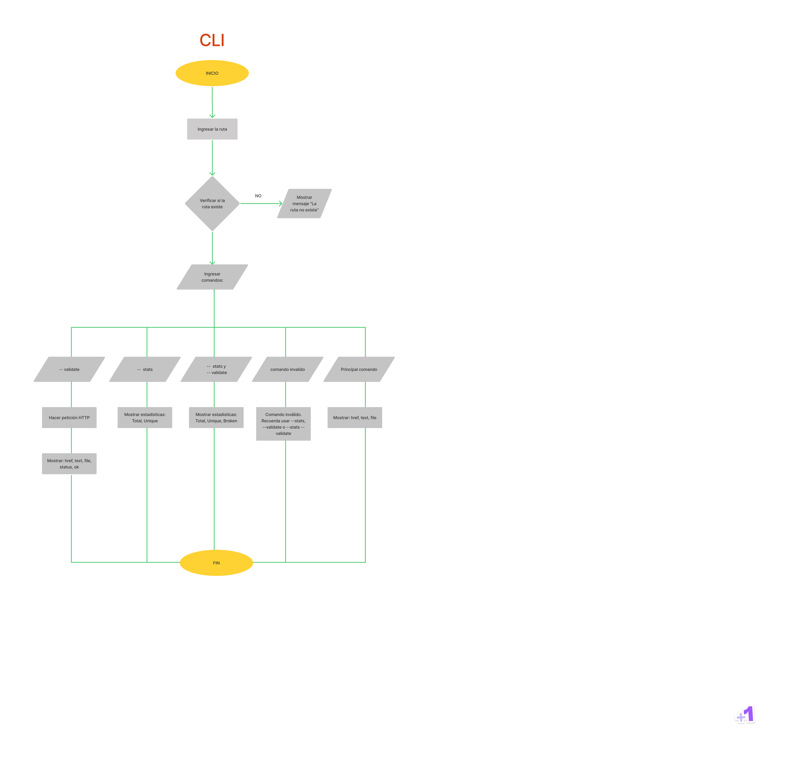

## Índice

* [MdLinks By Jeane](#MdLinks-By-Jeane)
* [1. Flujogramas](#1-Flujogramas)
* [2. Guía de uso](#2-Guía-de-uso)
* [3. Liberías empleadas](#3-Liberías-empleadas)
* [4. Fuentes](#4-Fuentes)
* [5. Autores](#4-Autores)

***
# MdLinks By Jeane

Librería desarrollada en node.js para verificar que todos los links provenientes de un archivo con lenguaje Markdown(.md), sean válidos. Así mismo, reconoce los links que están rotos y podrá arrojarte estadísticas entre links válidos y no válidos.

## 1. Flujogramas

## 1.1 Flujograma API



******
## 1.1 Flujograma CLI



******

## 2. Guía de uso

### 2.1 Instalación

```sh
npm i md-links-jeane
```

### 2.2 Uso de librería

```sh
const md-links = require('md-links-jeane');
```

#### 2.3 Interfaz de Linea de Comando (CLI)

Se ejecuta de la siguiente manera a través del terminal:

```sh
$ md-links <path> [options]
```

Ejemplo:

```sh
$ md-links carpeta_de_prueba
href: https://nodejs.org/dist/latest-v17.x/docs/api/fs.html
text: a link
file: C:\Users\Jeanella\Desktop\LIM016-md-links\carpeta_de_prueba\carpeta_prueba_1\fs.md
```

#### 2.3.1 Options

* #### --validate

Si pasamos la opción "--validate", la libería hará una petición HTTP al link correspondiente y regresará el status. Si el link se reedirige a una URL que corresponde a un código de estado HTTP del rango 200 - 399, entonces consideraremos que el link es válido, por lo tanto retornara como mensaje "ok", pero si en caso el link se reedirige a una URL que corresponde a un código de estado HTTP tal como el 404, consideraremos que el link esta roto, por lo tanto devolvera como mensaje "fail"

Por ejemplo:

```sh
href: https://nodejs.org/dist/latest-v17.x/docs/api/fs.html
text: a link
file: C:\Users\Jeanella\Desktop\LIM016-md-links\carpeta_de_prueba\carpeta_prueba_1\fs.md
status: 200
message: ok
```
```sh
href: https://bitly.com/404-error-page
text: error
file: C:\Users\Jeanella\Desktop\LIM016-md-links\carpeta_de_prueba\carpeta_prueba_1\fs.md
status: 404
message: fail
```

* #### --stats

Si pasamos la opción "--stats" nos retornará las estadísticas (total de links y links únicos) de la carpeta u archivo ingresado.

```sh
md-links carpeta_de_prueba --stats
Total: 4
Unique: 3
```

* #### --validate --stats o --stats --validate

Si pasamos la opción "--validate --stats ó --stats --validate}2 nos retornará las estadísticas (total de links, links únicos y links rotos ) de la carpeta u archivo ingresado.

```sh
$ md-links carpeta_de_prueba --validate --stats
Total: 4
Unique: 3
Broken: 1
```

* #### --help
Si pasamos la opción "--help" nos retornará un texto indicando las opciones válidas y lo que retorna cada una

```sh
md-links carpeta_de_prueba --help

  ******************** MD-LINKS HELP ********************
    Debe ingresar la ruta del archivo ya sea relativa o absoluta, por ejemplo:

      C:/Users/Jeanella/Desktop/LIM016-md-links/carpeta_de_prueba

                                 o también:
      carpeta_de_prueba

    Opciones válidas:

      --stats
          ¿Para qué sirve?
            Te mostrará el total de links y los links únicos que encontró
          Ejemplo:
            mdLinks <route> --stats

      --validate
          ¿Para qué sirve?
            Te mostrará el link (href), el texto que figura para enlazar el link (text), su ruta (file), el statuts y el mensaje del status (message)
          Ejemplo:
            mdLinks <route> --validate

      --stats --validate  o --validate --stats
          ¿Para qué sirve?
            Te mostrará el total de links, unicos y rotos.
          Ejemplo:
            md-links <route> --stats --validate

    También si escribes solamente "md-links carpeta_de_prueba" obtendrás el link, el texto que lo enlaza y su ruta
```
******

## 3. Liberías empleadas

- [File-Sytem](https://nodejs.org/dist/latest-v17.x/docs/api/fs.html#file-system)
- [Path](https://nodejs.org/dist/latest-v17.x/docs/api/path.html)
- [Node-Fetch*](https://www.npmjs.com/package/node-fetch)

*Se empleó la versión "^2.6.1" de node-fetch para poder usar [CommonJS](https://www.npmjs.com/package/node-fetch#loading-and-configuring-the-module).

## 4. Fuentes 📚
- [Repositorio de Laboratoria](https://github.com/Laboratoria/LIM016-md-links)

## 5. Autores 📍
- [Jeanella Hugo](https://github.com/jeanecvh)
